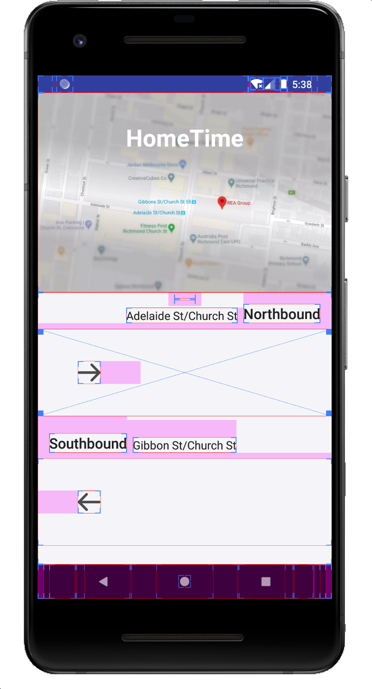

# Debugging

Debugging is one of the most important capability during development. As an UI developer, we need to know how to debug program running logic but also UI rendering result. *Android Studio* provides powerful debugging tools for use, besides that, there are also some useful 3rd party debugging tools provided by other tech company.

## Basic - Debug

### Analyze crash

At the beginning, if we start building an Android app, there always be some unexpected crashes:


How do we track what happened cause the crash?


Android Studio supports logging crash stack trace in **Logcat** window, once your app is crashed, the first step is to check crash log.

### Add log info

The [`Log`](<https://developer.android.com/reference/android/util/Log>) class allows you to create log messages that appear in **Logcat**.Generally, you should use the following log methods, listed in order from the highest to lowest priority (or, least to most verbose):

- `Log.e(String, String)` (error)
- `Log.w(String, String)` (warning)
- `Log.i(String, String)` (information)
- `Log.d(String, String)` (debug)
- `Log.v(String, String)` (verbose)


### Breakpoint

Before debugging with breakpoints, you need to make sure debug toggle is on in `app/build.gradle`:

```groovy
android {
    buildTypes {
        debug {
            debuggable true
        }
    }
}
```

Look at the screenshot, there are some important functionality provided by IDE:

##### 1. Debug entrance

##### 2. Attach debugger to Android process

When app is already in running  mode, we need to use it to attach debugger, so breakpoints will be catched.

##### 3. Debug commands

- Resume 
- Pause 
- Stop 
- View breakpoints
- Mute breakpoints
- Get thread bump

##### 4. Breakpoints command

- step over
- step into
- force step into
- step out


### Layout Inspector

The Layout Inspector in Android Studio allows you to compare your app layout with design mockups, display a magnified view of your app, and examine details of its layout **at runtime**. This is useful when your layout is built at runtime rather than entirely in XML and the layout is behaving unexpectedly.

After your app is running, open Layout Inspector in Tools, select app process.


The view tree is on the left panel, and the properties table is on the right panel.

### Show layout bounds on device

If you want to check UI layout bounds, you could enable `Show Layout bounds` in *Settings -> System -> Developer Options*.



## Advanced - Profile

An app is considered to have poor performance if it responds slowly, shows choppy animations, freezes, crashes, or consumes a lot of power. To avoid these performance problems, use the profiling and benchmarking tools listed on this page to identify where your app is making inefficient use of resources, such as the CPU, memory, graphics, network, and device battery.

- [Android Profile](<https://developer.android.com/studio/profile/android-profiler?hl=en>) - measure app performance


- [CPU Profiler](<https://developer.android.com/studio/profile/cpu-profiler?hl=en>) - inspect CPU activity


- [Network Profiler](<https://developer.android.com/studio/profile/network-profiler?hl=en>) - inspect network traffic


- [Memory Profiler](<https://developer.android.com/studio/profile/memory-profiler?hl=en>) - view the Java heap and memory allocations


- [Energy Profiler](<https://developer.android.com/studio/profile/energy-profiler?hl=en>) - inspect energy use


## Tools

### LeakCanary

[LeakCanary](https://square.github.io/leakcanary/) is a memory leak detection library for Android. 

> ## What is a memory leak?[¶](https://square.github.io/leakcanary/fundamentals/#what-is-a-memory-leak)
>
> In a Java based runtime, a memory leak is a programming error that causes an application to keep a reference to an object that is no longer needed. As a result, the memory allocated for that object cannot be reclaimed, eventually leading to an OutOfMemoryError crash.
>
> For example, an Android activity instance is no longer needed after its `onDestroy()` method is called, and storing a reference to that activity in a static field would prevent it from being garbage collected.


### Charles

Charles is an HTTP proxy / HTTP monitor / Reverse Proxy that enables a developer to view all of the HTTP and SSL / HTTPS traffic between their machine and the Internet. This includes requests, responses and the HTTP headers (which contain the cookies and caching information).

#### Configure steps

1. Make sure mobile device and Charles are in same wifi environment.

2. Configure Proxy, proxy's hostname and port should be same as Charles's configuration.(Open *Help > SSL Proxying > Install Charles Root Certificate on Mobile Device or Remote Browser*)


3. Install the certificate from [chls.pro/ssl](chls.pro/ssl)

 Then you'll get the requests from device.


## Further Reading

- [Android Studio Debug](https://developer.android.com/studio/debug?hl=en)

- [Android Studio Profile](https://developer.android.com/studio/profile?hl=en)

- [Charles](https://www.charlesproxy.com/)

- [LeakCanary](https://square.github.io/leakcanary/)